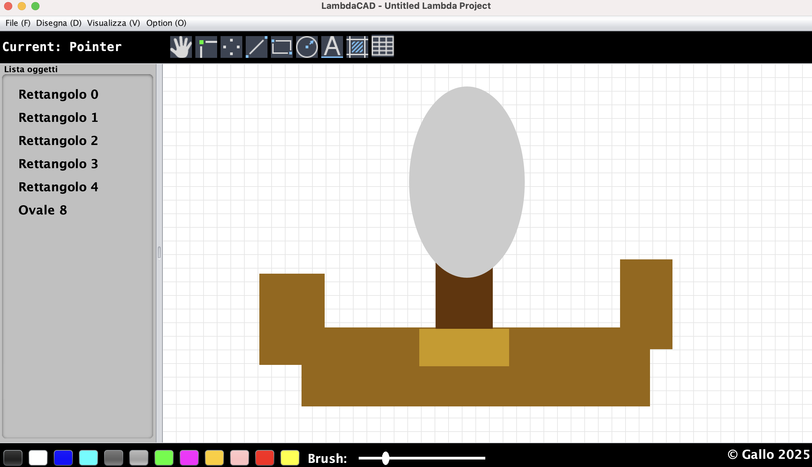
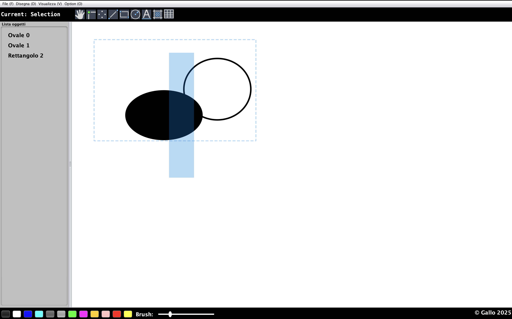

# LambdaCAD

## 📋 Descrizione del Progetto
Questo repository contiene **LambdaCAD**, un software ***CAD*** e di ***disegno*** realizzato in Java. LambdaCAD utilizza un’estensione custom (`.lambda`) per salvare i progetti, offrendo un’interfaccia a griglia e una vasta gamma di strumenti per la progettazione tecnica e la creazione di schizzi.

---

## 📦 Download
- [👉 Scarica l'ultima versione di LambdaCAD](https://github.com/Fraalloo/LambdaCAD/releases/latest)

---

## 🎨 Screenshots
<div align="center"></div>
<div align="center"></div>
<div align="center"></div>

---

## 📁 Project Structure
```
.
├── Makefile                   # Build automation script
├── README.md                  # Project documentation
├── pom.xml                    # Maven configuration file
|── ui                         # UI screens
|   ├── ui1.png
|   └── ui2.png
├── src
│   ├── main
│   │   ├── assets
│   │   │   └── images         # Icons and images for the UI
│   │   │       ├── disegnamenu
│   │   │       │   ├── color.png
│   │   │       │   ├── delete.png
│   │   │       │   ├── fill.png
│   │   │       │   ├── grid.png
│   │   │       │   └── stroke.png
│   │   │       ├── entity
│   │   │       │   ├── cattura.png
│   │   │       │   ├── fill.bmp
│   │   │       │   ├── grid.png
│   │   │       │   ├── ovale.bmp
│   │   │       │   ├── pointer.bmp
│   │   │       │   ├── punto.bmp
│   │   │       │   ├── rettangolo.bmp
│   │   │       │   ├── segmento.bmp
│   │   │       │   └── stringa.bmp
│   │   │       ├── filemenu
│   │   │       │   ├── export.png
│   │   │       │   ├── new.png
│   │   │       │   ├── open.png
│   │   │       │   ├── print.png
│   │   │       │   ├── save.png
│   │   │       │   └── saveas.png
│   │   │       ├── logo
│   │   │       │   └── logo.png
│   │   │       ├── optmenu
│   │   │       │   ├── git.png
│   │   │       │   ├── info.png
│   │   │       │   ├── redo.png
│   │   │       │   ├── rename.png
│   │   │       │   ├── tutto.png
│   │   │       │   └── undo.png
│   │   │       └── vismenu
│   │   │           ├── 1.png
│   │   │           ├── 2.png
│   │   │           └── 3.png
│   │   └── java
│   │       └── com
│   │           └── gallo
│   │               └── it
│   │                   ├── Main.java               # Application entry point
│   │                   ├── components
│   │                   │   ├── App.java             # Core application logic & UI management
│   │                   │   ├── Counter.java
│   │                   │   ├── Detail.java
│   │                   │   ├── Draw.java            # Handles drawing operations on the grid
│   │                   │   ├── Footer.java
│   │                   │   ├── Header.java
│   │                   │   └── Menu.java            # Implements the application menu and toolbar
│   │                   ├── entity
│   │                   │   ├── Entity.java          # Base class for drawing elements
│   │                   │   ├── OvaleEntity.java
│   │                   │   ├── PuntoEntity.java
│   │                   │   ├── RettangoloEntity.java
│   │                   │   ├── SegmentoEntity.java
│   │                   │   └── SelectionEntity.java
│   │                   └── shape
│   │                       ├── Ovale.java             # Shape implementations for the drawing canvas
│   │                       ├── Punto.java
│   │                       ├── Rettangolo.java
│   │                       ├── Segmento.java
│   │                       └── Shape.java
└── src
    └── test
        └── java
            └── com
                └── gallo
                    └── it
                        └── AppTest.java       # Test suite for the application (Not used, but expected from Maven)
```

### Dettagli sui Componenti
- **`Main.java`**: Il punto di ingresso dell'applicazione, responsabile dell'inizializzazione della GUI e delle funzionalità CAD.
- **`components/`**: Contiene i componenti grafici.
- **`entity/`**: Contiene le entità da disegnare.
- **`shape/`**: Contiene le figure geometriche.

---

## 🚀 Come Eseguire l'Applicazione

### **Prerequisiti**
Assicurati di avere installato:
- **Java Development Kit (JDK) 8 o superiore**
- **Maven 3**
- Un ambiente compatibile con **make** (opzionale, ma consigliato per semplificare i comandi)

### **Esecuzione del File JAR**
Per eseguire direttamente l'applicazione:
```bash
make run
```

### **Costruire il Progetto con Makefile**
Per compilare e creare l'archivio JAR tramite Maven, utilizza:
```bash
make build
```

### **Altri comandi utili del Makefile**
```bash
make init   # Inizializza un nuovo progetto Maven con l'archetipo quickstart
make test   # Esegue la suite di test del progetto (Non implemenentata)
make prod   # Prepara la distribuzione copiando il JAR nella cartella 'dist/jar'
```

---

## 📚 Panoramica del Codice

- **Forme e Entità:**
  - **Shape.java**: Interfaccia che definisce metodi base delle figure geometriche, implementi nelle sottoclassi (**Punto**, **Segmento**, **Rettangolo**, **Ovale**).
  - **Entity.java**: Classe astratta che definisce le entità, cioè oggetti che incapsulano classi Shape e definiscono i metodi per disegnarli (**PuntoEntity**, **SegmentoEntity**, **RettangoloEntity**, **OvaleEntity**, **StringaEntity**, **SelectionEntity**).


- **Interfaccia Utente (UI):**  
  - **Draw.java**: L’area di disegno a griglia dove vengono creati i disegni.
  - **Header.java** e **Footer.java**: Aree contenenti alcune opzioni di disegno.
  - **Menu.java**: Gestisce le opzioni più avanzate, includendo comandi come Nuovo disegno, Apri, Salva, Esporta PNG, Undo, Redo, ecc.
  - **Detail.java**: Mostra l'elenco delle Entity disegnate, permettendo una selezione precisa.

- **Gestione File e Utility:**  
  - **Draw.java**: dedicato alla lettura/scrittura dei file con estensione **lambda**, assicurando la conservazione di tutte le informazioni del disegno, e dell'esportazione come **PNG**.
  - **App.java** di supporto per operazioni come undo/redo e modifica degli attributi degli oggetti (colore, spessore, ecc.).

- **Punto d'Ingresso:**  
  - **Main.java**: Inizializza e avvia l'applicazione.
  - **App.java**: Inizializzata da Main.java, orchestra l'interazione tra i vari componenti UI e ne gestisce eventi e input.

---

## 🧰 Tecnologie Utilizzate
- **Java**
- **AWT**
- **Swing**
- **Maven**
- **Makefile**  

---

## 📜 Licenza
Questo progetto è distribuito sotto la **MIT License**. Consulta il file `License.txt` per ulteriori dettagli.

---

## 📧 Contatti
- **Autore:** [Gallo Francesco](https://github.com/Fraalloo)
- **Email:** gallfrancgall@gmail.com